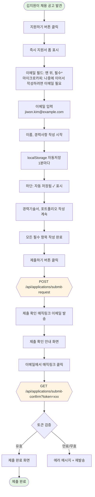
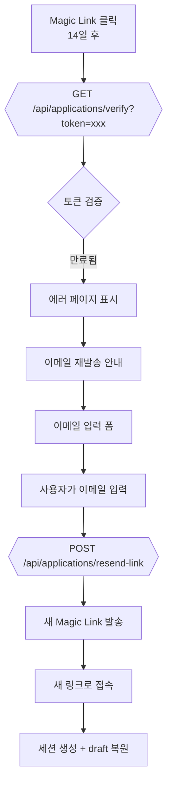
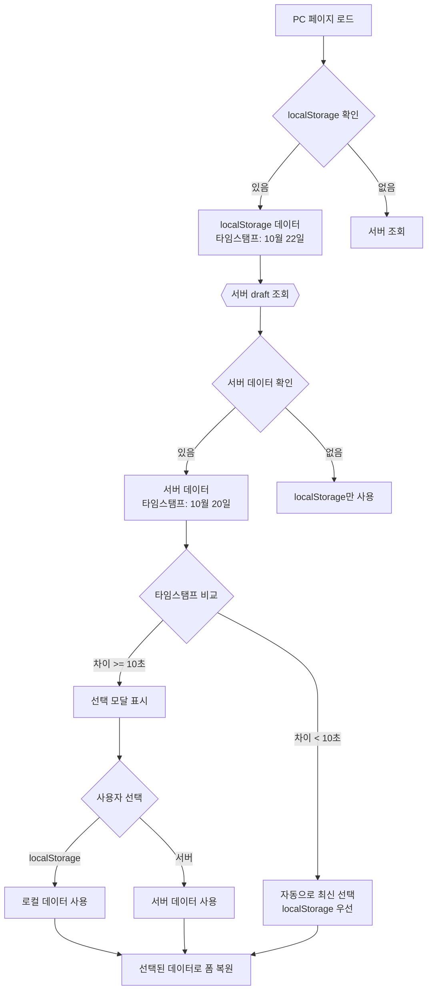

```mermaid
flowchart TD
    Start([회사 PC: 공고 발견]) --> A1[회사 PC: 지원하기 클릭]
    A1 --> A2[회사 PC: 즉시 지원서 폼 진입]
    A2 --> A3[회사 PC: 이메일 + 기본 정보 입력]

    A3 --> B1[회사 PC: localStorage 자동저장]
    B1 --> B2[회사 PC: 나중에 이어서 작성하기 클릭]
    B2 --> API1{{POST /api/applications/save}}
    API1 --> B3[서버 저장 + Magic Link 발송]

    B3 --> C1([퇴근 후 집 PC로 이동])
    C1 --> C2[집 PC: 개인 이메일 접속]
    C2 --> C3[집 PC: Magic Link 클릭]
    C3 --> API2{{GET /api/applications/verify?token=xxx}}

    API2 --> C4[집 PC: 세션 쿠키 발급 + 리다이렉트]
    C4 --> C5[집 PC: 지원서 페이지 로드]

    C5 --> D1{localStorage 확인}
    D1 -->|없음| D2[서버 데이터 조회]
    D1 -->|있음 오래됨| D2

    D2 --> API3{{GET /api/applications/draft}}
    API3 --> D3[서버 데이터 있음<br/>회사 PC에서 저장한 내용]

    D3 --> E1[집 PC: 자동 복원]
    E1 --> E2[토스트: 회사 PC에서 작성한 내용 불러옴]
    E2 --> E3[집 PC: 추가 작성]

    E3 --> E4[집 PC: localStorage + 서버 자동저장]
    E4 --> F1[집 PC: 제출하기 클릭]
    F1 --> API4{{POST /api/applications/submit-request}}
    API4 --> F2[제출 확인 매직링크 발송]
    F2 --> F3[이메일에서 매직링크 클릭]
    F3 --> API5{{GET /api/applications/submit-confirm?token=xxx}}
    API5 --> End([제출 완료])
```

```mermaid
flowchart TD
    Start([모바일: 지하철에서 공고 발견]) --> A1[모바일: 지원하기 클릭]
    A1 --> A2[모바일: 즉시 지원서 폼 진입]
    A2 --> A3[모바일: 이메일 + 기본 정보 입력]

    A3 --> B1[모바일: localStorage 자동저장]
    B1 --> B2[모바일: 나중에 이어서 작성하기 클릭]
    B2 --> API1{{POST /api/applications/save}}
    API1 --> B3[서버 저장 + Magic Link 발송]

    B3 --> C1([집 도착: PC로 전환])
    C1 --> C2[PC: Gmail에서 Magic Link 클릭]
    C2 --> API2{{GET /api/applications/verify?token=xxx}}

    API2 --> C3[PC: 세션 쿠키 발급 + 리다이렉트]
    C3 --> C4[PC: 지원서 페이지 로드]

    C4 --> D1{localStorage 확인}
    D1 -->|없음| D2[서버 데이터 조회]
    D1 -->|있음 오래됨| D2

    D2 --> API3{{GET /api/applications/draft}}
    API3 --> D3[서버 데이터 있음<br/>모바일에서 저장한 내용]

    D3 --> E1[PC: 자동 복원]
    E1 --> E2[토스트: 모바일에서 작성한 내용 불러옴]
    E2 --> E3[PC: 추가 작성 + 파일 첨부]

    E3 --> E4[PC: localStorage + 서버 자동저장]
    E4 --> F1[PC: 제출하기 클릭]
    F1 --> API4{{POST /api/applications/submit-request}}
    API4 --> F2[제출 확인 매직링크 발송]
    F2 --> F3[이메일에서 매직링크 클릭]
    F3 --> API5{{GET /api/applications/submit-confirm?token=xxx}}
    API5 --> End([제출 완료])

    style Start fill:#e1f0ff
    style C1 fill:#ffe1f0
    style End fill:#e1f5e1
    style API1 fill:#fff4e1
    style API2 fill:#fff4e1
    style API3 fill:#fff4e1
    style API4 fill:#fff4e1
```

# 지원자 Magic Link 유저 플로우 (최종본)

## 문서 정보
- 작성일: 2025-10-20
- 버전: v2.0 (진입 플로우 개선)
- 작성자: 메리 (B2B SaaS UX Designer)
- 관련 문서: 01-technical-architecture.md, 보리 인터뷰 노트

### 변경 이력
- **v1.0** (Part 1, Part 2): 이메일 입력 화면 먼저 → 지원서 폼
- **v2.0** (이 문서): 지원서 폼 먼저 → 이메일은 필드 중 하나 (진입 장벽 최소화)

---

## Overview

```
[지원하기] 클릭
  ↓
바로 지원서 작성 폼 (이메일 필드 포함)  ← 즉시 시작
```

#### 설계 근거

1. **Foot-in-the-door 효과 활용**
   - 작은 commitment(폼 작성) 먼저 → 큰 commitment(이메일 입력) 확률 증가
   - 지원자가 시간 투자 후 "저장하려면 이메일 필요" → 입력 동기 강화

2. **경쟁사 패턴 분석**
   - **Lever, LinkedIn Easy Apply**: 폼 먼저, 이메일은 필드 중 하나
   - **Workday**: 이메일 먼저 (엔터프라이즈, 보안 중시)
   - **결론**: 소비자 대상 제품은 폼 먼저가 업계 표준

3. **localStorage + Magic Link 하이브리드 전략**
   - **localStorage**: 대부분 케이스 커버 (같은 디바이스 재접속)
   - **Magic Link**: 기기 간 이동 지원 (차별화 포인트)
   - 두 방식의 장점을 모두 활용

4. **명확한 UX Writing**
   - "저장하기" (X) → 왜 이메일이 필요한지 불명확
   - **"나중에 이어서 작성하기"** (O) → 목적과 가치 명확

### 핵심 인증 방식

1. **Magic Link 기반 인증**: 이메일로 발송된 링크 클릭으로 세션 생성
2. **세션 쿠키**: 14일 유효, 디바이스별 독립 관리
3. **localStorage 자동저장**: 1분마다 또는 입력 시마다 (세션 없이도 작동)
4. **매직링크 기반 제출**: 최종 제출 시 매직링크로 확인

### 기술 스펙 요약

- **Magic Link 유효기간**: 14일 (재사용 가능)
- **세션 쿠키**:
- **로컬 스토리지**:
  - 세션 없이도 자동 저장 (1분마다)

---

## Case 1: Happy Path (단일 디바이스 정상 플로우)

### 시나리오
김지원(29세, 제품 기획자)이 회사 채용 공고를 발견하고 집 노트북에서 지원서를 작성해 제출하는 표준 시나리오.

**행동 패턴:**
- 저녁 시간에 집에서 지원서 작성 시작
- 30분 정도 이력서와 경력기술서 작성
- 잠깐 쉬고 돌아와서 나머지 작성
- 당일 제출 완료

### Mermaid Flowchart



### 상세 단계

#### Phase 1: 즉시 지원서 폼 진입 (NEW)

**Step 1.1 - 지원하기 버튼 클릭**

사용자 행동:
- 채용 공고 페이지에서 "지원하기" 버튼 클릭
- **별도 이메일 입력 화면 없이 바로 지원서 폼 진입** (핵심 변경)

UI:
```
━━━━━━━━━━━━━━━━━━━━━━━━━━━━━━━━━━━━━━
제품 기획자 지원서

이메일 주소 *
[                                        ]
💡 나중에 이어서 작성하려면 이메일이 필요해요

이름 *
[                                        ]

연락처 *
[                                        ]

경력사항 *
┌────────────────────────────────────────┐
│ 회사명:                                │
│ 직무:                                  │
│ 기간:                                  │
│ 주요 업무:                             │
└────────────────────────────────────────┘

... (나머지 필드)

━━━━━━━━━━━━━━━━━━━━━━━━━━━━━━━━━━━━━━
💾 자동 저장됨 (아직 저장 안 됨)

[나중에 이어서 작성하기]    [제출하기]
━━━━━━━━━━━━━━━━━━━━━━━━━━━━━━━━━━━━━━
```

**핵심 UX 요소**:
1. **이메일 필드 위치**: 이력서 폼 상단 위치
2. **마이크로카피**: "나중에 이어서 작성하려면 이메일이 필요해요"
   - 명확한 가치 제안
   - 강제가 아닌 선택의 여지 제공
4. **이력서 최종 버튼**:
   - "나중에 이어서 작성하기" (목적 명확)
   - "제출하기" (최종 제출)

UI 피드백:
```
━━━━━━━━━━━━━━━━━━━━━━━━━━━━━━━━━━━━━━
💾 자동 저장됨 (방금 전)

[나중에 이어서 작성하기]    [제출하기]
━━━━━━━━━━━━━━━━━━━━━━━━━━━━━━━━━━━━━━
```

#### Phase 2: "나중에 이어서 작성하기" 버튼 (NEW)

**Step 2.1 - 버튼 클릭 (이메일 미입력 케이스)**

사용자 행동:
- 이메일 필드를 건너뛰고 다른 필드만 작성
- "나중에 이어서 작성하기" 버튼 클릭

시스템 동작:
1. 이메일 필드 검증
2. 빈 값 → 인라인 에러 표시
3. API 호출하지 않음

UI (에러 상태):
```
━━━━━━━━━━━━━━━━━━━━━━━━━━━━━━━━━━━━━━
제품 기획자 지원서

이메일 주소 *
[                                        ] ← 빨간색 테두리
❌ 이메일을 입력해주세요

💡 다른 기기에서도 이어서 작성하려면 이메일이 필요합니다

이름 *
[김지원                                  ]

... (나머지 필드는 정상)
━━━━━━━━━━━━━━━━━━━━━━━━━━━━━━━━━━━━━━
```


**Step 2.2 - "나중에 이어서 작성하기" 버튼 클릭 (이메일 입력된 케이스)**

사용자 행동:
- 이메일 포함 모든 필드 일부 작성
- "나중에 이어서 작성하기" 버튼 클릭


UI 피드백 (토스트):
```
━━━━━━━━━━━━━━━━━━━━━━━━━━━━━━━━━━━━━━
✅ 저장되었습니다

jiwon.kim@example.com로 링크를 보내드렸어요.
이메일의 링크를 클릭하면 다른 기기에서도
이어서 작성할 수 있어요.

💡 이 페이지에서 계속 작성하셔도 됩니다.
━━━━━━━━━━━━━━━━━━━━━━━━━━━━━━━━━━━━━━
```

### UX Writing (Magic Link 이메일):
```
제목: [회사명] 제품 기획자 지원서 이어서 작성하기

안녕하세요, 김지원님

제품 기획자 포지션 지원서를 다른 기기에서도
이어서 작성하시려면 아래 버튼을 클릭해주세요.

[지원서 이어서 작성하기]
(버튼 URL: https://company.com/apply?token=abc123...)

💡 이 링크는 14일간 사용 가능하며,
   작성 중인 내용은 자동으로 저장됩니다.

현재 작성 진행도: 약 40%
마지막 저장: 2025년 10월 20일 19:23

궁금한 점이 있으시면 recruit@company.com으로 문의해주세요.
```

#### Phase 3: 제출

**Step 3.1 - 제출하기 버튼 활성화**

조건:
- 모든 필수 입력 항목 완료 (이메일 포함)
- 유효한 이메일 형식

UI:
```
━━━━━━━━━━━━━━━━━━━━━━━━━━━━━━━━━━━━━━
💾 자동 저장됨 (방금 전)

[나중에 이어서 작성하기]    [제출하기] ← 활성화

ℹ️ 제출 시 이메일로 확인 링크를 보내드립니다
━━━━━━━━━━━━━━━━━━━━━━━━━━━━━━━━━━━━━━
```

**Step 3.2 - 제출 요청**

사용자 행동:
- "제출하기" 버튼 클릭

시스템 동작:
1. 최종 데이터 검증
2. 제출 확인 매직링크 이메일 발송


**Step 3.3 - 제출 완료 화면**

UI:
```
━━━━━━━━━━━━━━━━━━━━━━━━━━━━━━━━━━━━━━
     ✅  지원서 제출이 완료되었습니다

     제품 기획자 포지션
     제출 일시: 2025년 10월 20일 19:35

     제출 확인을 위해 이메일로 링크를
     보내드렸습니다

     [확인]

     💡 전형 결과는 이메일로 안내드리겠습니다
━━━━━━━━━━━━━━━━━━━━━━━━━━━━━━━━━━━━━━
```

시스템 동작:
1. 제출 상태 DB 업데이트 
2. 제출 확인 매직링크 이메일 발송
3. localStorage 정리 (`draft_{position_id}` 삭제)

---

## Case 2: 직장인 이직 준비자 (회사 PC → 집 PC 전환)

### 시나리오
박민수(32세, 개발자)는 현재 재직 중이며 비밀리에 이직을 준비 중입니다. 점심시간에 회사 PC에서 지원서 작성을 시작하고, 퇴근 후 집 PC에서 이어서 작성합니다.

**행동 패턴:**
- 점심시간에 회사 PC에서 공고 발견 및 지원서 작성 시작
- 이메일 입력 + 기본 정보 입력 후 "나중에 이어서 작성하기" 클릭
- Magic Link 이메일 수신 (하지만 회사 PC에서는 개인 이메일 접근 불가)
- 퇴근 후 집 PC에서 Magic Link 클릭
- 회사에서 작성한 내용 자동 복원
- 집에서 추가 작성 후 제출

**핵심 UX 과제:**
1. 디바이스 전환 시 데이터 동기화
2. 서버에 저장된 데이터 자동 복원
3. 명확한 피드백 ("회사 PC에서 작성한 내용을 불러왔습니다")

### Mermaid Flowchart



### 상세 단계

#### Phase 1: 회사 PC에서 작성 및 저장

**Step 1.1 - 회사 PC에서 폼 작성**

사용자 행동:
- 점심시간 회사 PC에서 채용 공고 발견
- "지원하기" 클릭 → 즉시 지원서 폼 진입
- 이메일 입력: `minsoo@gmail.com`
- 이름, 연락처, 간단한 경력사항 입력

UI (회사 PC):
```
━━━━━━━━━━━━━━━━━━━━━━━━━━━━━━━━━━━━━━
백엔드 개발자 지원서

이메일 주소 *
[minsoo@gmail.com                        ]
💡 나중에 이어서 작성하려면 이메일이 필요해요

이름 *
[박민수                                  ]

연락처 *
[010-9876-5432                           ]

경력사항 *
┌────────────────────────────────────────┐
│ 회사명: 현재회사                       │
│ 직무: 백엔드 개발자                    │
│ 기간: 2020.01 - 현재                   │
│ 주요 업무: Node.js 기반 API 서버...    │
└────────────────────────────────────────┘

━━━━━━━━━━━━━━━━━━━━━━━━━━━━━━━━━━━━━━
💾 자동 저장됨 (30초 전)

[나중에 이어서 작성하기]    [제출하기]
━━━━━━━━━━━━━━━━━━━━━━━━━━━━━━━━━━━━━━
```

**Step 1.2 - "나중에 이어서 작성하기" 클릭 (회사 PC)**

사용자 행동:
- 점심시간 종료 임박
- "나중에 이어서 작성하기" 버튼 클릭

시스템 동작:
1. 이메일 필드 검증 (입력됨)
2. 서버 저장 API 호출
3. Magic Link 이메일 발송

UI 피드백 (토스트):
```
━━━━━━━━━━━━━━━━━━━━━━━━━━━━━━━━━━━━━━
✅ 저장되었습니다

minsoo@gmail.com로 링크를 보내드렸어요.
이메일의 링크를 클릭하면 다른 기기에서도
이어서 작성할 수 있어요.
━━━━━━━━━━━━━━━━━━━━━━━━━━━━━━━━━━━━━━
```

#### Phase 2: 집 PC에서 Magic Link 클릭

**Step 2.1 - Magic Link 클릭 (집 PC)**

사용자 행동:
- 퇴근 후 집 PC에서 개인 Gmail 접속
- Magic Link 이메일 확인
- "지원서 이어서 작성하기" 버튼 클릭

시스템 동작:
1. 토큰 검증 (유효)
2. 집 PC용 새 세션 생성
3. 쿠키 발급
4. 지원서 페이지로 리다이렉트

**Step 2.2 - 서버 데이터 자동 복원 (집 PC)**

클라이언트 동작:
1. 페이지 로드
2. localStorage 확인 → 없음 (집 PC는 처음 접속)
3. 세션 쿠키 확인 → 있음
4. 서버 draft 조회

UI (집 PC - 자동 복원 직후):
```
━━━━━━━━━━━━━━━━━━━━━━━━━━━━━━━━━━━━━━
━━━━━━━━━━━━━━━━━━━━━━━━━━━━━━━━━━━━━━
     ℹ️  이전에 작성한 내용을 불러왔습니다

     마지막 저장: 2025년 10월 20일 12:45
     (약 6시간 전)
━━━━━━━━━━━━━━━━━━━━━━━━━━━━━━━━━━━━━━
━━━━━━━━━━━━━━━━━━━━━━━━━━━━━━━━━━━━━━

백엔드 개발자 지원서

이메일 주소 *
[minsoo@gmail.com                        ] ✓

이름 *
[박민수                                  ] ✓

연락처 *
[010-9876-5432                           ] ✓

경력사항 *
┌────────────────────────────────────────┐
│ 회사명: 현재회사                       │ ✓
│ 직무: 백엔드 개발자                    │
│ 기간: 2020.01 - 현재                   │
│ 주요 업무: Node.js 기반 API 서버...    │
└────────────────────────────────────────┘

(나머지 필드는 비어있음)

━━━━━━━━━━━━━━━━━━━━━━━━━━━━━━━━━━━━━━
💾 서버에서 불러옴 (6시간 전)

[나중에 이어서 작성하기]    [제출하기]
━━━━━━━━━━━━━━━━━━━━━━━━━━━━━━━━━━━━━━
```


#### Phase 3: 집 PC에서 추가 작성 및 제출

**Step 3.1 - 추가 작성 (집 PC)**

사용자 행동:
- 포트폴리오 섹션 작성
- 코딩 테스트 링크 추가
- 자기소개서 완성

UI (집 PC - 작성 중):
```
━━━━━━━━━━━━━━━━━━━━━━━━━━━━━━━━━━━━━━
... (기존 필드들)

포트폴리오
┌────────────────────────────────────────┐
│ GitHub: https://github.com/minsoo      │
│ 코딩 테스트: https://...               │
└────────────────────────────────────────┘

자기소개 *
┌────────────────────────────────────────┐
│ 5년차 백엔드 개발자로...               │
│                                        │
└────────────────────────────────────────┘

━━━━━━━━━━━━━━━━━━━━━━━━━━━━━━━━━━━━━━
💾 자동 저장됨 (방금 전)

[나중에 이어서 작성하기]    [제출하기] ← 활성화
━━━━━━━━━━━━━━━━━━━━━━━━━━━━━━━━━━━━━━
```


**Step 3.2 - 제출 (집 PC)**

Case 1과 동일:
1. "제출하기" 버튼 클릭
2. 제출 완료

### 기술 스펙 요약

**디바이스별 저장 위치:**

| 디바이스 | localStorage | 서버 DB | 세션 쿠키 |
|---------|-------------|---------|----------|
| 회사 PC | ✓ (12:45 저장) | ✓ (12:45 저장) | ✗ (없음) |
| 집 PC | ✓ (21:15 저장, 서버에서 동기화) | ✓ (21:15 저장) | ✓ (sess_home456) |

**데이터 흐름:**
```
회사 PC 작성
  ↓
localStorage (회사 PC) + 서버 DB
  ↓
Magic Link 발송
  ↓
집 PC에서 링크 클릭 → 세션 생성
  ↓
서버 DB에서 데이터 조회
  ↓
집 PC로 복원 (폼 + localStorage)
  ↓
집 PC에서 추가 작성
  ↓
제출
```

---

## Case 3: 모바일 ↔ PC 전환

### 시나리오
이서연(27세, 디자이너)은 출퇴근 중 모바일에서 지원서 작성을 시작하고, 집에 도착해서 PC로 이어서 작성합니다.

**행동 패턴:**
1. 지하철에서 모바일로 공고 발견 및 지원 시작
2. 모바일에서 기본 정보 입력 후 "나중에 이어서 작성하기" 클릭
3. Magic Link 수신
4. 집 도착 후 PC로 Magic Link 클릭
5. 모바일에서 작성한 내용 자동 복원
6. PC에서 포트폴리오 파일 첨부 후 제출

**핵심 UX 과제:**
1. 모바일과 PC 간 데이터 동기화
2. 모바일에서 작성한 내용이 PC에 정확히 반영
3. 반대 방향 (PC → 모바일) 전환도 지원
4. 파일 첨부는 PC 권장 안내

### Mermaid Flowchart



### 상세 단계

#### Phase 1: 모바일에서 작성

**Step 1.1 - 모바일에서 폼 작성**

사용자 행동:
- 지하철에서 모바일 브라우저로 채용 공고 발견
- "지원하기" 클릭 → 즉시 지원서 폼 진입
- 이메일 입력: `seoyeon.lee@gmail.com`
- 이름, 연락처, 간단한 자기소개 입력

UI (모바일):
```
┌──────────────────────────┐
│ UI/UX 디자이너 지원서    │
│                          │
│ 이메일 주소 *            │
│ [seoyeon.lee@gmail.com]  │
│ 💡 나중에 이어서        │
│    작성하려면 이메일이   │
│    필요해요              │
│                          │
│ 이름 *                   │
│ [이서연              ]   │
│                          │
│ 연락처 *                 │
│ [010-1111-2222       ]   │
│                          │
│ 자기소개 *               │
│ ┌──────────────────────┐ │
│ │ 5년차 UI/UX         │ │
│ │ 디자이너로...        │ │
│ └──────────────────────┘ │
│                          │
│ 💾 자동 저장됨 (방금 전) │
│                          │
│ [나중에 이어서 작성하기] │
│ [제출하기]               │
└──────────────────────────┘
```

**Step 1.2 - "나중에 이어서 작성하기" 클릭 (모바일)**

사용자 행동:
- 지하철 도착 임박
- "나중에 이어서 작성하기" 버튼 클릭
```

UI 피드백 (모바일 토스트):
```
┌──────────────────────────┐
│ ✅ 저장되었습니다        │
│                          │
│ seoyeon.lee@gmail.com로  │
│ 링크를 보내드렸어요.     │
│                          │
│ 💡 PC에서도 이어서       │
│    작성할 수 있어요      │
└──────────────────────────┘
```


### 5.4 Magic Link 만료

#### 시나리오
- 지원자가 14일 후 Magic Link 클릭
- 토큰 만료 에러

#### Flowchart



#### 에러 UI

```
━━━━━━━━━━━━━━━━━━━━━━━━━━━━━━━━━━━━━━
     ⚠️  링크가 만료되었습니다

     이 링크는 14일 전에 발급되어 만료되었습니다.

     이메일 주소를 입력하시면
     새 링크를 보내드립니다.

     이메일 주소:
     [                                    ]

     [새 링크 받기]

     💡 작성 중이던 내용은 안전하게 저장되어 있습니다
━━━━━━━━━━━━━━━━━━━━━━━━━━━━━━━━━━━━━━
```


## Case 6: Edge Cases

### 6.1 localStorage와 서버 데이터 충돌

#### 시나리오
- 지원자가 PC에서 작성 후 저장 (서버 + localStorage)
- 며칠 후 같은 PC에서 오프라인 상태로 작성 (localStorage만)
- 다시 온라인 → localStorage와 서버 데이터가 다름

#### Flowchart



#### 선택 모달 UI

```
━━━━━━━━━━━━━━━━━━━━━━━━━━━━━━━━━━━━━━
     ⚠️  작성 중인 내용이 여러 개 발견되었습니다

     어떤 내용으로 이어서 작성할까요?

     ○ 이 PC에 저장된 내용 (권장)
        마지막 저장: 10월 22일 14:30
        진행도: 약 75%
        미리보기: "5년차 백엔드 개발자로..."

     ○ 서버에 저장된 내용
        마지막 저장: 10월 20일 12:45
        진행도: 약 40%
        미리보기: "Node.js 기반 API 서버..."

     [선택한 내용으로 시작하기]

     💡 선택하지 않은 내용은 삭제됩니다
━━━━━━━━━━━━━━━━━━━━━━━━━━━━━━━━━━━━━━
```


### 6.2 동시 편집 (두 디바이스에서 동시 작성)

#### 시나리오
- 지원자가 PC에서 작성 중
- 동시에 모바일에서도 같은 지원서 작성
- 나중에 저장한 쪽이 덮어쓰기

#### 시스템 동작

**Last-Write-Wins 정책**:
- 서버는 항상 마지막으로 받은 데이터를 저장
- 타임스탬프 기준으로 최신 데이터 유지
- 충돌 해결은 클라이언트 로드 시점에 처리

예시:
```
14:00 - PC에서 저장 (서버: PC 데이터)
14:05 - 모바일에서 저장 (서버: 모바일 데이터, PC 데이터 덮어씀)
14:10 - PC 페이지 새로고침 → 서버에서 모바일 데이터 로드
        → 선택 모달: "모바일에서 작성한 내용 (최신)" vs "이 PC에 저장된 내용"
```

#### 안내 메시지

```
━━━━━━━━━━━━━━━━━━━━━━━━━━━━━━━━━━━━━━
     ℹ️  다른 기기에서 작성한 내용이 있습니다

     모바일에서 작성한 내용 (5분 전)과
     이 PC에 저장된 내용 (10분 전)이 다릅니다.

     어떤 내용으로 계속 작성할까요?

     ○ 모바일에서 작성한 내용 (권장)
     ○ 이 PC에 저장된 내용

     [선택하기]
━━━━━━━━━━━━━━━━━━━━━━━━━━━━━━━━━━━━━━
```

---

## UX Writing 가이드

### 마이크로카피

**이메일 필드 하단**:
```
💡 나중에 이어서 작성하려면 이메일이 필요해요
```

**이메일 필드 에러**:
```
❌ 이메일을 입력해주세요
💡 다른 기기에서도 이어서 작성하려면 이메일이 필요합니다
```

**자동 저장 상태**:
```
💾 자동 저장됨 (방금 전)
💾 자동 저장됨 (30초 전)
💾 자동 저장됨 (5분 전)
💾 모바일에서 불러옴 (1시간 전)
💾 서버에서 불러옴 (6시간 전)
```

### 토스트 메시지

**저장 성공**:
```
✅ 저장되었습니다

{email}로 링크를 보내드렸어요.
이메일의 링크를 클릭하면 다른 기기에서도
이어서 작성할 수 있어요.

💡 이 페이지에서 계속 작성하셔도 됩니다.
```

**데이터 복원**:
```
ℹ️  이전에 작성한 내용을 불러왔습니다

마지막 저장: 2025년 10월 20일 12:45
(약 6시간 전)
```

### 버튼 레이블

- **나중에 이어서 작성하기** (O) - 목적과 가치 명확
- ~~저장하기~~ (X) - 왜 이메일이 필요한지 불명확
- **제출하기** - 최종 제출