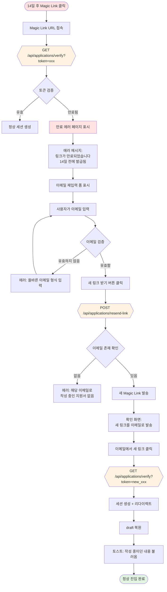
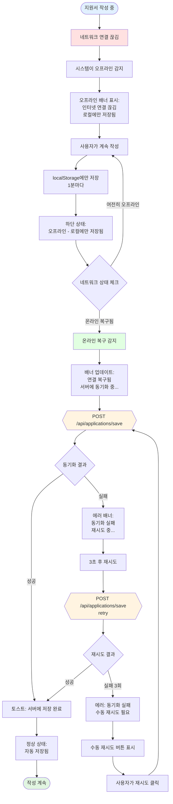
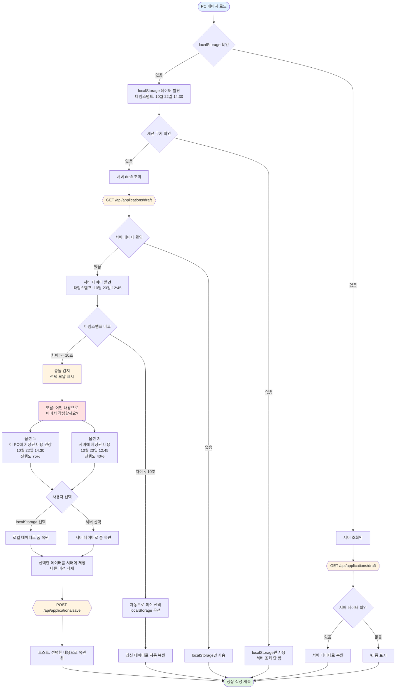
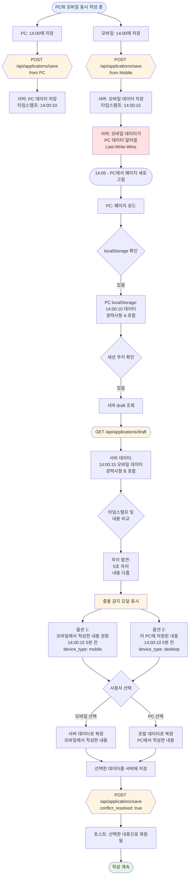
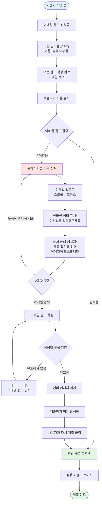
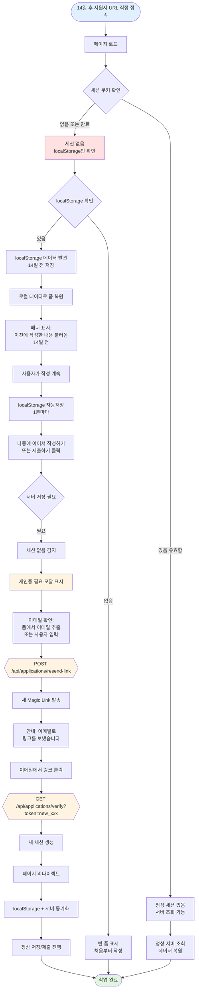

```mermaid
flowchart TD
    Start([회사 PC: 공고 발견]) --> A1[회사 PC: 지원하기 클릭]
    A1 --> A2[회사 PC: 즉시 지원서 폼 진입]
    A2 --> A3[회사 PC: 이메일 + 기본 정보 입력]

    A3 --> B1[회사 PC: localStorage 자동저장]
    B1 --> B2[회사 PC: 나중에 이어서 작성하기 클릭]
    B2 --> API1{{POST /api/applications/save}}
    API1 --> B3[서버 저장 + Magic Link 발송]

    B3 --> C1([퇴근 후 집 PC로 이동])
    C1 --> C2[집 PC: 개인 이메일 접속]
    C2 --> C3[집 PC: Magic Link 클릭]
    C3 --> API2{{GET /api/applications/verify?token=xxx}}

    API2 --> C4[집 PC: 세션 쿠키 발급 + 리다이렉트]
    C4 --> C5[집 PC: 지원서 페이지 로드]

    C5 --> D1{localStorage 확인}
    D1 -->|없음| D2[서버 데이터 조회]
    D1 -->|있음 오래됨| D2

    D2 --> API3{{GET /api/applications/draft}}
    API3 --> D3[서버 데이터 있음<br/>회사 PC에서 저장한 내용]

    D3 --> E1[집 PC: 자동 복원]
    E1 --> E2[토스트: 회사 PC에서 작성한 내용 불러옴]
    E2 --> E3[집 PC: 추가 작성]

    E3 --> E4[집 PC: localStorage + 서버 자동저장]
    E4 --> F1[집 PC: 제출하기 클릭]
    F1 --> API4{{POST /api/applications/submit-request}}
    API4 --> F2[제출 확인 매직링크 발송]
    F2 --> F3[이메일에서 매직링크 클릭]
    F3 --> API5{{GET /api/applications/submit-confirm?token=xxx}}
    API5 --> End([제출 완료])

    style Start fill:#e1f0ff
    style C1 fill:#ffe1f0
    style End fill:#e1f5e1
    style API1 fill:#fff4e1
    style API2 fill:#fff4e1
    style API3 fill:#fff4e1
    style API4 fill:#fff4e1
    style API5 fill:#fff4e1
```

```mermaid
flowchart TD
    Start([모바일: 지하철에서 공고 발견]) --> A1[모바일: 지원하기 클릭]
    A1 --> A2[모바일: 즉시 지원서 폼 진입]
    A2 --> A3[모바일: 이메일 + 기본 정보 입력]

    A3 --> B1[모바일: localStorage 자동저장]
    B1 --> B2[모바일: 나중에 이어서 작성하기 클릭]
    B2 --> API1{{POST /api/applications/save}}
    API1 --> B3[서버 저장 + Magic Link 발송]

    B3 --> C1([집 도착: PC로 전환])
    C1 --> C2[PC: Gmail에서 Magic Link 클릭]
    C2 --> API2{{GET /api/applications/verify?token=xxx}}

    API2 --> C3[PC: 세션 쿠키 발급 + 리다이렉트]
    C3 --> C4[PC: 지원서 페이지 로드]

    C4 --> D1{localStorage 확인}
    D1 -->|없음| D2[서버 데이터 조회]
    D1 -->|있음 오래됨| D2

    D2 --> API3{{GET /api/applications/draft}}
    API3 --> D3[서버 데이터 있음<br/>모바일에서 저장한 내용]

    D3 --> E1[PC: 자동 복원]
    E1 --> E2[토스트: 모바일에서 작성한 내용 불러옴]
    E2 --> E3[PC: 추가 작성 + 파일 첨부]

    E3 --> E4[PC: localStorage + 서버 자동저장]
    E4 --> F1[PC: 제출하기 클릭]
    F1 --> API4{{POST /api/applications/submit-request}}
    API4 --> F2[제출 확인 매직링크 발송]
    F2 --> F3[이메일에서 매직링크 클릭]
    F3 --> API5{{GET /api/applications/submit-confirm?token=xxx}}
    API5 --> End([제출 완료])

    style Start fill:#e1f0ff
    style C1 fill:#ffe1f0
    style End fill:#e1f5e1
    style API1 fill:#fff4e1
    style API2 fill:#fff4e1
    style API3 fill:#fff4e1
    style API4 fill:#fff4e1
    style API5 fill:#fff4e1
```

# 지원자 Magic Link 유저 플로우 - Mermaid Flowcharts 완전판

## 문서 정보
- 작성일: 2025-10-22
- 버전: v1.0
- 작성자: 메리 (B2B SaaS UX Designer)
- 관련 문서: 02-user-flows-final.md, 01-technical-architecture.md

## 개요

이 문서는 지원자 Magic Link 기능의 모든 사용자 플로우를 Mermaid 다이어그램으로 시각화합니다. 각 케이스는 실제 사용자 시나리오를 기반으로 하며, API 호출, 의사결정 지점, 에러 처리 경로를 포함합니다.

---

## 목차

1. [Case 1: Happy Path (단일 디바이스 정상 플로우)](#case-1-happy-path-단일-디바이스-정상-플로우)
2. [Case 2: 직장인 이직 준비자 (회사 PC → 집 PC 전환)](#case-2-직장인-이직-준비자-회사-pc--집-pc-전환)
3. [Case 3: 모바일 ↔ PC 전환](#case-3-모바일--pc-전환)
4. [Case 4: Magic Link 만료](#case-4-magic-link-만료)
5. [Case 5: 네트워크 오류 및 복구](#case-5-네트워크-오류-및-복구)
6. [Case 6.1: localStorage와 서버 데이터 충돌](#case-61-localstorage와-서버-데이터-충돌)
7. [Case 6.2: 동시 편집 (두 디바이스 동시 작성)](#case-62-동시-편집-두-디바이스-동시-작성)
8. [Case 7: 이메일 미입력 상태에서 제출 시도](#case-7-이메일-미입력-상태에서-제출-시도)
9. [Case 8: 세션 만료 후 재접속](#case-8-세션-만료-후-재접속)

---

## Case 1: Happy Path (단일 디바이스 정상 플로우)

### 시나리오
김지원(29세, 제품 기획자)이 회사 채용 공고를 발견하고 집 노트북에서 지원서를 작성해 제출하는 표준 시나리오.

**행동 패턴:**
- 저녁 시간에 집에서 지원서 작성 시작
- 30분 정도 이력서와 경력기술서 작성
- 잠깐 쉬고 돌아와서 나머지 작성
- 당일 제출 완료

### Flowchart

```mermaid
c
```

### 기술 노트
- **localStorage 자동저장**: 1분마다 또는 필드 변경 시
- **제출 확인 Magic Link**: 이메일을 통한 2단계 제출 확인
- **세션 쿠키**: 제출 완료 후에도 14일간 유지

---

## Case 2: 직장인 이직 준비자 (회사 PC → 집 PC 전환)

### 시나리오
박민수(32세, 개발자)는 현재 재직 중이며 비밀리에 이직을 준비 중입니다. 점심시간에 회사 PC에서 지원서 작성을 시작하고, 퇴근 후 집 PC에서 이어서 작성합니다.

**행동 패턴:**
- 점심시간에 회사 PC에서 공고 발견 및 지원서 작성 시작
- 이메일 입력 + 기본 정보 입력 후 "나중에 이어서 작성하기" 클릭
- Magic Link 이메일 수신
- 퇴근 후 집 PC에서 Magic Link 클릭
- 회사에서 작성한 내용 자동 복원
- 집에서 추가 작성 후 제출

**핵심 UX 과제:**
1. 디바이스 전환 시 데이터 동기화
2. 서버에 저장된 데이터 자동 복원
3. 명확한 피드백 ("회사 PC에서 작성한 내용을 불러왔습니다")

### Flowchart



### 기술 노트
- **디바이스별 세션**: 각 디바이스는 독립적인 세션 쿠키 보유
- **서버 데이터 우선순위**: 새 디바이스에서는 서버 데이터가 localStorage보다 우선
- **자동 복원 피드백**: "회사 PC에서 작성한 내용을 불러왔습니다 (6시간 전)" 표시

---

## Case 3: 모바일 ↔ PC 전환

### 시나리오
이서연(27세, 디자이너)은 출퇴근 중 모바일에서 지원서 작성을 시작하고, 집에 도착해서 PC로 이어서 작성합니다.

**행동 패턴:**
1. 지하철에서 모바일로 공고 발견 및 지원 시작
2. 모바일에서 기본 정보 입력 후 "나중에 이어서 작성하기" 클릭
3. Magic Link 수신
4. 집 도착 후 PC로 Magic Link 클릭
5. 모바일에서 작성한 내용 자동 복원
6. PC에서 포트폴리오 파일 첨부 후 제출

**핵심 UX 과제:**
1. 모바일과 PC 간 데이터 동기화
2. 모바일에서 작성한 내용이 PC에 정확히 반영
3. 반대 방향 (PC → 모바일) 전환도 지원
4. 파일 첨부는 PC 권장 안내

### Flowchart



### 기술 노트
- **디바이스 감지**: User-Agent를 통해 모바일/PC 구분
- **파일 첨부 UX**: 모바일에서는 "PC에서 첨부하는 것을 권장합니다" 안내
- **반응형 UI**: 모바일과 PC에 최적화된 폼 레이아웃

---

## Case 4: Magic Link 만료

### 시나리오
- 지원자가 14일 후 Magic Link 클릭
- 토큰 만료 에러
- 새 링크 재발급 플로우

**핵심 UX 과제:**
1. 명확한 만료 안내
2. 간단한 재발급 프로세스
3. 작성 중이던 데이터 보존 보장

### Flowchart



### UI 스펙

**만료 에러 페이지:**
```
━━━━━━━━━━━━━━━━━━━━━━━━━━━━━━━━━━━━━━
     ⚠️  링크가 만료되었습니다

     이 링크는 14일 전에 발급되어 만료되었습니다.

     이메일 주소를 입력하시면
     새 링크를 보내드립니다.

     이메일 주소:
     [                                    ]

     [새 링크 받기]

     💡 작성 중이던 내용은 안전하게 저장되어 있습니다
━━━━━━━━━━━━━━━━━━━━━━━━━━━━━━━━━━━━━━
```

### 기술 노트
- **토큰 만료**: 14일 후 자동 만료
- **데이터 보존**: 토큰 만료와 무관하게 서버 draft는 유지
- **재발급 횟수**: 제한 없음 (스팸 방지는 rate limiting으로)

---

## Case 5: 네트워크 오류 및 복구

### 시나리오
- 지원자가 지원서 작성 중 네트워크 연결 끊김
- localStorage에는 계속 저장됨
- 네트워크 복구 후 자동 동기화

**핵심 UX 과제:**
1. 오프라인 상태에서도 작성 가능
2. 네트워크 복구 시 자동 동기화
3. 명확한 상태 피드백

### Flowchart



### UI 스펙

**오프라인 배너:**
```
━━━━━━━━━━━━━━━━━━━━━━━━━━━━━━━━━━━━━━
⚠️ 인터넷 연결이 끊겼습니다
   작성한 내용은 이 기기에만 저장됩니다
━━━━━━━━━━━━━━━━━━━━━━━━━━━━━━━━━━━━━━
```

**동기화 중 배너:**
```
━━━━━━━━━━━━━━━━━━━━━━━━━━━━━━━━━━━━━━
✅ 연결 복구됨
   서버에 동기화 중... [스피너]
━━━━━━━━━━━━━━━━━━━━━━━━━━━━━━━━━━━━━━
```

**동기화 실패 배너:**
```
━━━━━━━━━━━━━━━━━━━━━━━━━━━━━━━━━━━━━━
⚠️ 서버 동기화 실패
   [다시 시도]

   💡 작성한 내용은 이 기기에 안전하게 저장되어 있습니다
━━━━━━━━━━━━━━━━━━━━━━━━━━━━━━━━━━━━━━
```

### 기술 노트
- **오프라인 감지**: `navigator.onLine` + API 요청 실패 모니터링
- **재시도 정책**: Exponential backoff (3초, 6초, 12초)
- **최대 재시도**: 3회 후 수동 재시도 필요
- **localStorage 우선**: 오프라인 시 모든 데이터는 로컬에 보존

---

## Case 6.1: localStorage와 서버 데이터 충돌

### 시나리오
- 지원자가 PC에서 작성 후 저장 (서버 + localStorage)
- 며칠 후 같은 PC에서 오프라인 상태로 작성 (localStorage만)
- 다시 온라인 → localStorage와 서버 데이터가 다름

**핵심 UX 과제:**
1. 두 버전의 데이터 중 어느 것을 사용할지 선택
2. 명확한 차이점 표시 (타임스탬프, 진행도, 미리보기)
3. 선택하지 않은 데이터는 삭제됨을 명확히 고지

### Flowchart



### UI 스펙

**충돌 선택 모달:**
```
━━━━━━━━━━━━━━━━━━━━━━━━━━━━━━━━━━━━━━
     ⚠️  작성 중인 내용이 여러 개 발견되었습니다

     어떤 내용으로 이어서 작성할까요?

     ○ 이 PC에 저장된 내용 (권장)
        마지막 저장: 10월 22일 14:30
        진행도: 약 75%
        미리보기: "5년차 백엔드 개발자로..."

     ○ 서버에 저장된 내용
        마지막 저장: 10월 20일 12:45
        진행도: 약 40%
        미리보기: "Node.js 기반 API 서버..."

     [선택한 내용으로 시작하기]

     💡 선택하지 않은 내용은 삭제됩니다
━━━━━━━━━━━━━━━━━━━━━━━━━━━━━━━━━━━━━━
```

### 기술 노트
- **타임스탬프 비교 로직**: 10초 이상 차이 나면 충돌로 간주
- **진행도 계산**: 필수 필드 중 작성된 비율
- **미리보기 생성**: 자기소개서 또는 경력사항 첫 30자
- **선택 후 처리**: 선택한 버전을 서버에 덮어쓰기

---

## Case 6.2: 동시 편집 (두 디바이스 동시 작성)

### 시나리오
- 지원자가 PC에서 작성 중
- 동시에 모바일에서도 같은 지원서 작성
- 나중에 저장한 쪽이 서버에 덮어쓰기
- 한쪽 디바이스에서 페이지 새로고침 시 충돌 감지

**핵심 UX 과제:**
1. Last-Write-Wins 정책으로 서버 저장
2. 충돌 감지 시 명확한 선택 UI
3. 어느 디바이스에서 작성했는지 표시
4. 실시간 동기화 없음 (복잡도 관리)

### Flowchart



### 상세 시나리오 타임라인

```
14:00:00 - PC와 모바일 모두 작성 중
14:00:10 - PC에서 "나중에 이어서 작성하기" 클릭
           → 서버: PC 데이터 저장 (경력사항 A)
14:00:15 - 모바일에서 "나중에 이어서 작성하기" 클릭
           → 서버: 모바일 데이터 저장 (경력사항 B)
           → PC 데이터 덮어씀 (Last-Write-Wins)

14:05:00 - PC에서 페이지 새로고침
           → PC localStorage: 14:00:10 데이터 (경력사항 A)
           → 서버: 14:00:15 모바일 데이터 (경력사항 B)
           → 충돌 감지: 타임스탬프와 내용 모두 다름

14:05:05 - 충돌 모달 표시
           → 사용자가 "모바일에서 작성한 내용" 선택
           → 서버 데이터로 복원
```

### UI 스펙

**동시 편집 충돌 모달:**
```
━━━━━━━━━━━━━━━━━━━━━━━━━━━━━━━━━━━━━━
     ℹ️  다른 기기에서 작성한 내용이 있습니다

     모바일에서 작성한 내용 (5분 전)과
     이 PC에 저장된 내용 (5분 전)이 다릅니다.

     어떤 내용으로 계속 작성할까요?

     ○ 모바일에서 작성한 내용 (권장)
        저장 시각: 14:00:15 (5분 전)
        디바이스: 📱 Mobile
        미리보기: "React 기반 프론트엔드..."

     ○ 이 PC에 저장된 내용
        저장 시각: 14:00:10 (5분 전)
        디바이스: 💻 Desktop
        미리보기: "Node.js 기반 백엔드..."

     [선택하기]

     ⚠️  동시에 여러 기기에서 작성하면
        마지막에 저장한 내용만 유지됩니다
━━━━━━━━━━━━━━━━━━━━━━━━━━━━━━━━━━━━━━
```

### 기술 노트

**Last-Write-Wins 정책:**
- 서버는 항상 마지막으로 받은 데이터를 저장
- 타임스탬프는 서버 시간 기준 (클라이언트 시간 불신)
- 덮어쓰기 전 이전 버전 백업 없음 (단순성 유지)

**충돌 감지 로직:**
```javascript
// 충돌 조건
if (localData && serverData) {
  const timeDiff = Math.abs(
    new Date(localData.timestamp) - new Date(serverData.timestamp)
  );

  const contentDiff = JSON.stringify(localData.form_data) !==
                      JSON.stringify(serverData.form_data);

  // 타임스탬프 차이가 10초 이상 OR 내용이 다르면 충돌
  if (timeDiff >= 10000 || contentDiff) {
    showConflictModal();
  }
}
```

**디바이스 타입 저장:**
```javascript
// 서버에 저장 시 디바이스 정보 포함
{
  "form_data": { ... },
  "device_info": {
    "type": "mobile" | "desktop",
    "user_agent": "...",
    "timestamp": "2025-10-22T14:00:15Z"
  }
}
```

**UX 가이드라인:**
- **권장 옵션**: 항상 최신 타임스탬프를 권장으로 표시
- **디바이스 아이콘**: 모바일(📱), PC(💻)로 시각적 구분
- **미리보기**: 자기소개서 또는 경력사항 첫 30자
- **경고 메시지**: 동시 편집 위험성 명확히 고지

---

## Case 7: 이메일 미입력 상태에서 제출 시도

### 시나리오
- 지원자가 이메일 필드를 건너뛰고 다른 필드만 작성
- "제출하기" 버튼 클릭 시도
- 이메일 필드 검증 실패

**핵심 UX 과제:**
1. 명확한 에러 표시
2. 이메일이 왜 필요한지 재설명
3. 포커스를 이메일 필드로 이동

### Flowchart



### UI 스펙

**이메일 필드 에러 상태:**
```
━━━━━━━━━━━━━━━━━━━━━━━━━━━━━━━━━━━━━━
제품 기획자 지원서

이메일 주소 *
[                                        ] ← 빨간색 테두리, 포커스
❌ 이메일을 입력해주세요

💡 제출 확인을 위해 이메일이 필요합니다
   jiwon@example.com 형식으로 입력해주세요

이름 *
[김지원                                  ] ✓

... (나머지 필드는 정상)
━━━━━━━━━━━━━━━━━━━━━━━━━━━━━━━━━━━━━━
```

**이메일 형식 에러:**
```
이메일 주소 *
[jiwon@                                  ] ← 빨간색 테두리
❌ 올바른 이메일 형식이 아닙니다
   예: jiwon@example.com
```

### 기술 노트
- **클라이언트 검증**: 필수 필드 및 이메일 형식 검증
- **포커스 이동**: `element.scrollIntoView({ behavior: 'smooth' })`
- **에러 메시지 타이밍**: 제출 버튼 클릭 직후 즉시 표시
- **재제출 방지**: 이메일 입력 전까지 제출 버튼 비활성화 옵션

---

## Case 8: 세션 만료 후 재접속

### 시나리오
- 지원자가 Magic Link로 세션 생성
- 14일 후 세션 쿠키 만료
- 같은 디바이스에서 지원서 페이지 재접속
- localStorage 데이터는 남아있음

**핵심 UX 과제:**
1. 세션 없어도 localStorage 데이터 활용
2. 서버 저장 필요 시 재인증 유도
3. 데이터 손실 없이 안전한 복원

### Flowchart



### UI 스펙

**세션 만료 안내 배너 (페이지 로드 시):**
```
━━━━━━━━━━━━━━━━━━━━━━━━━━━━━━━━━━━━━━
ℹ️  이전에 작성한 내용을 불러왔습니다

   마지막 저장: 10월 8일 14:30 (14일 전)

   💡 계속 작성하시거나 제출하려면
      이메일 인증이 필요합니다
━━━━━━━━━━━━━━━━━━━━━━━━━━━━━━━━━━━━━━
```

**재인증 필요 모달:**
```
━━━━━━━━━━━━━━━━━━━━━━━━━━━━━━━━━━━━━━
     🔒  이메일 인증이 필요합니다

     작성한 내용을 저장하거나 제출하려면
     이메일 인증이 필요합니다.

     이메일 주소:
     [jiwon@example.com                   ] ✓
     (지원서에 입력한 이메일)

     [인증 링크 받기]

     💡 작성 중인 내용은 이 기기에
        안전하게 저장되어 있습니다
━━━━━━━━━━━━━━━━━━━━━━━━━━━━━━━━━━━━━━
```

**인증 링크 발송 확인:**
```
━━━━━━━━━━━━━━━━━━━━━━━━━━━━━━━━━━━━━━
     ✅  인증 링크를 보냈습니다

     jiwon@example.com으로
     인증 링크를 보내드렸습니다.

     이메일의 링크를 클릭하면
     저장 및 제출을 진행할 수 있습니다.

     [확인]

     ℹ️  이 창을 닫고 작성을 계속하셔도 됩니다
        링크를 클릭하면 자동으로 동기화됩니다
━━━━━━━━━━━━━━━━━━━━━━━━━━━━━━━━━━━━━━
```

### 기술 노트

**세션 검증 로직:**
```javascript
// 페이지 로드 시
async function initializeForm() {
  const hasSession = await checkSession(); // API 호출로 검증
  const localData = localStorage.getItem('draft_jp_11111');

  if (!hasSession && localData) {
    // 세션 없지만 로컬 데이터 있음
    restoreFromLocalStorage(localData);
    showSessionExpiredBanner();
  } else if (hasSession) {
    // 정상 세션 있음
    const serverData = await fetchDraft();
    resolveDataConflict(localData, serverData);
  }
}
```

**재인증 트리거:**
```javascript
// 저장 또는 제출 시도 시
async function saveOrSubmit() {
  const hasSession = await checkSession();

  if (!hasSession) {
    // 재인증 필요
    const email = formData.email;
    showReauthModal(email);
  } else {
    // 정상 진행
    await submitToServer();
  }
}
```

**localStorage 유지 기간:**
- 브라우저 설정에 따라 무기한 보존 가능
- 사용자가 브라우저 데이터 삭제 시 삭제됨
- 서버 세션(14일)보다 길게 유지될 수 있음

---

## 기술 스펙 요약

### API 엔드포인트

| 엔드포인트 | 메소드 | 용도 | 인증 필요 |
|-----------|--------|------|----------|
| `/api/applications/save` | POST | 초안 저장 + Magic Link 발송 | No |
| `/api/applications/verify` | GET | Magic Link 토큰 검증 + 세션 생성 | No |
| `/api/applications/draft` | GET | 저장된 초안 조회 | Yes (세션) |
| `/api/applications/submit-request` | POST | 제출 요청 + 확인 Magic Link 발송 | Yes (세션) |
| `/api/applications/submit-confirm` | GET | 제출 확인 (Magic Link 클릭) | No |
| `/api/applications/resend-link` | POST | Magic Link 재발송 | No |

### localStorage 스키마

```javascript
{
  "draft_{position_id}": {
    "email": "user@example.com",
    "form_data": {
      "name": "홍길동",
      "phone": "010-1234-5678",
      "experience": [ ... ],
      // ... 모든 폼 필드
    },
    "last_modified": "2025-10-22T14:30:00Z",
    "device_info": {
      "type": "desktop" | "mobile",
      "user_agent": "..."
    }
  }
}
```

### 세션 쿠키

```
Name: session_token
Value: sess_abc123...
Domain: company.com
Path: /
Expires: 14 days
HttpOnly: true
Secure: true
SameSite: Lax
```

### 데이터 우선순위 로직

```
페이지 로드 시:
1. localStorage 확인
2. 세션 쿠키 확인
3. IF 세션 있음 → 서버 draft 조회
4. IF localStorage와 서버 데이터 모두 있음
   → 타임스탬프 비교
   → 10초 이상 차이 OR 내용 다름 → 충돌 모달
   → 10초 미만 차이 AND 내용 같음 → 최신 자동 선택
5. ELSE → 있는 쪽 데이터 사용
```

---

## UX Writing 가이드

### 마이크로카피

**이메일 필드:**
```
💡 나중에 이어서 작성하려면 이메일이 필요해요
```

**자동 저장 상태:**
```
💾 자동 저장됨 (방금 전)
💾 자동 저장됨 (30초 전)
💾 모바일에서 불러옴 (1시간 전)
💾 서버에서 불러옴 (6시간 전)
```

**네트워크 상태:**
```
⚠️ 오프라인 - 로컬에만 저장됨
✅ 연결 복구됨 - 서버에 동기화 중...
```

### 토스트 메시지

**저장 성공:**
```
✅ 저장되었습니다

{email}로 링크를 보내드렸어요.
이메일의 링크를 클릭하면 다른 기기에서도
이어서 작성할 수 있어요.
```

**데이터 복원:**
```
ℹ️  이전에 작성한 내용을 불러왔습니다

마지막 저장: 10월 20일 12:45 (6시간 전)
```

### 에러 메시지

**Magic Link 만료:**
```
⚠️  링크가 만료되었습니다

이 링크는 14일 전에 발급되어 만료되었습니다.
새 링크를 받으시려면 이메일을 입력해주세요.
```

**네트워크 오류:**
```
⚠️ 서버 동기화 실패

작성한 내용은 이 기기에 안전하게 저장되어 있습니다.
인터넷 연결을 확인하고 다시 시도해주세요.
```

---

## 디자인 가이드라인

### 색상 코드

- **성공 (녹색)**: `#e1f5e1` (배경), `#2e7d32` (텍스트)
- **경고 (노란색)**: `#fff4e1` (배경), `#f57c00` (텍스트)
- **에러 (빨간색)**: `#ffe1e1` (배경), `#d32f2f` (텍스트)
- **정보 (파란색)**: `#e1f0ff` (배경), `#1976d2` (텍스트)
- **API 호출 (주황색)**: `#fff4e1` (배경)

### 아이콘

- ✅ 성공
- ⚠️ 경고
- ❌ 에러
- ℹ️ 정보
- 💾 저장
- 💡 팁
- 🔒 인증 필요
- 📱 모바일
- 💻 데스크톱

### 애니메이션

**충돌 모달 진입:**
- Fade in + Scale up (0.95 → 1.0)
- Duration: 200ms
- Easing: ease-out

**토스트 메시지:**
- Slide up from bottom
- Duration: 300ms
- Auto-dismiss: 5초 후

**에러 필드:**
- Shake animation (left-right)
- Duration: 300ms
- 빨간색 테두리 + 포커스

---

## 부록: 의사결정 로직 참조

### 데이터 복원 우선순위

```
IF (localStorage 있음 AND 세션 있음) {
  서버 조회
  IF (서버 데이터 있음) {
    타임스탬프 비교
    IF (차이 >= 10초 OR 내용 다름) {
      충돌 모달 표시
    } ELSE {
      최신 데이터 자동 선택
    }
  } ELSE {
    localStorage 사용
  }
} ELSE IF (localStorage 있음 AND 세션 없음) {
  localStorage 사용
  세션 만료 배너 표시
} ELSE IF (localStorage 없음 AND 세션 있음) {
  서버 조회
  IF (서버 데이터 있음) {
    서버 데이터 사용
  } ELSE {
    빈 폼 표시
  }
} ELSE {
  빈 폼 표시
}
```

### 자동 저장 트리거

```
1. 타이머 기반: 1분마다
2. 필드 변경 시: debounce 3초
3. 버튼 클릭 시:
   - "나중에 이어서 작성하기" → localStorage + 서버
   - "제출하기" → 서버 제출 API
```

### 네트워크 오류 재시도

```
시도 1: 즉시
시도 2: 3초 후
시도 3: 6초 후
시도 4: 12초 후
실패: 수동 재시도 버튼 표시
```

---

## 문서 이력

- **v1.0** (2025-10-22): 초안 작성, 모든 케이스 Mermaid 플로우차트 완성
  - Case 1-3: 기존 문서에서 이관
  - Case 4-8: 신규 작성 (특히 Case 6.2 동시 편집 상세화)

---

**작성자**: 메리 (Senior B2B SaaS UX Designer)
**문서 상태**: ✅ Ready for Development
**다음 단계**: 개발팀과 기술 검토, 프로토타입 제작
