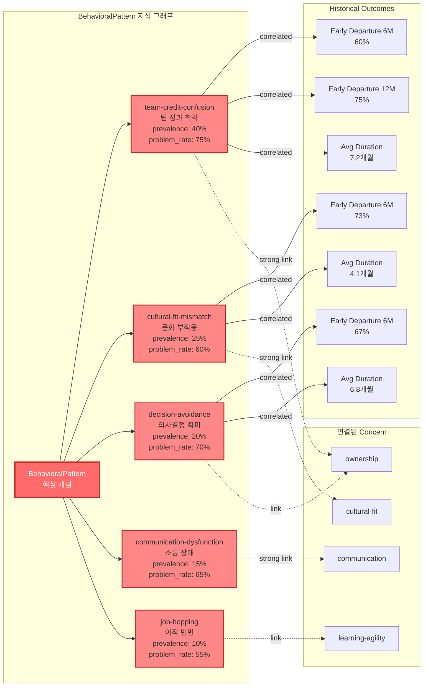
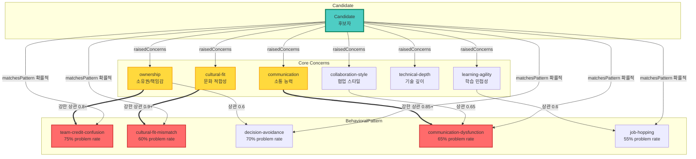
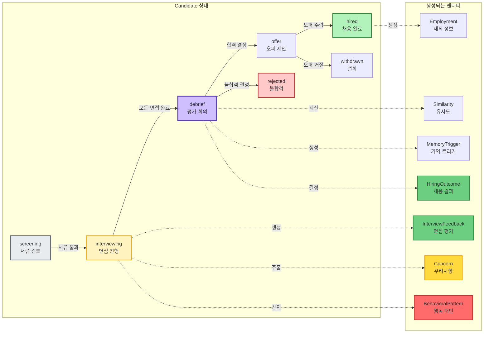
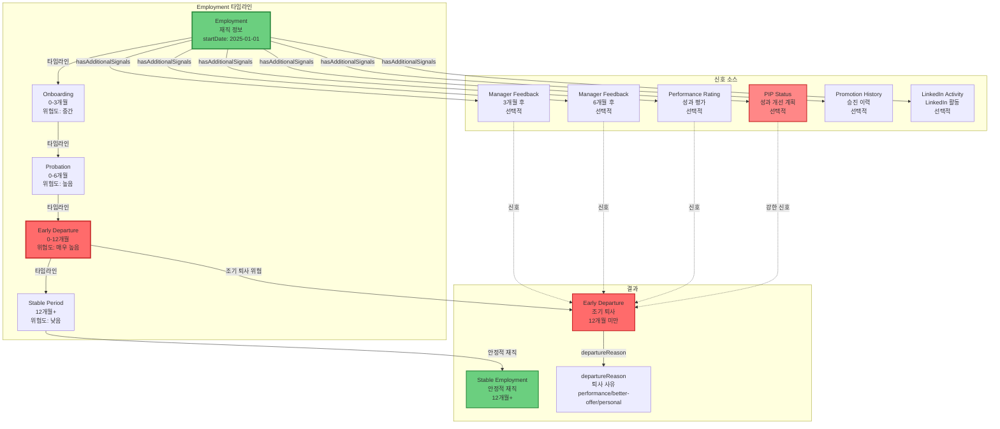
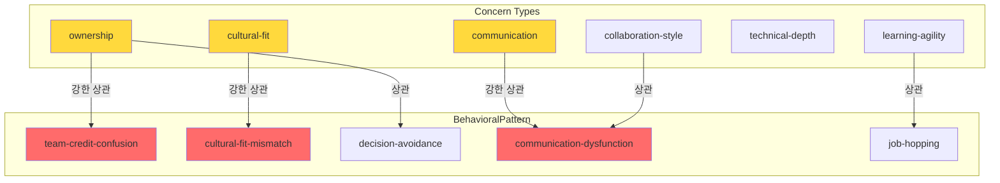
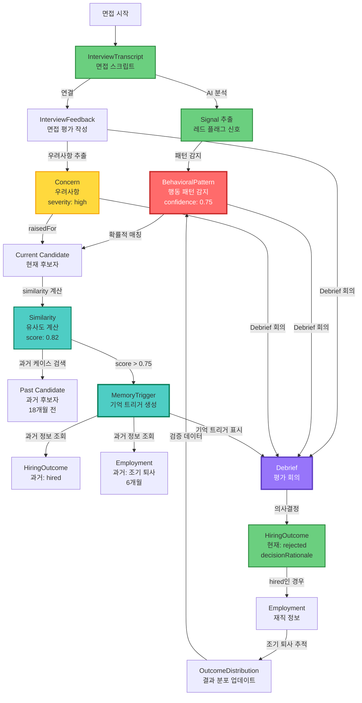

# 채용 온톨로지 v0.3 지식 그래프 시각화

**생성일:** 2025-01-20
**원본 문서:** `04-ontology-practical-v0.3.md`

---

## 🕸️ 전체 지식 그래프 (Knowledge Graph)

온톨로지의 모든 엔티티와 관계를 하나의 지식 그래프로 표현합니다.

```mermaid
graph TB
    %% Priority 1: 핵심 의사결정 지원 (빨간색 계열)
    subgraph P1["🔴 Priority 1: 핵심 의사결정 지원"]
        BP[BehavioralPattern<br/>행동 패턴<br/>5개 타입]
        CN[Concern<br/>우려사항<br/>6개 타입]
        HO[HiringOutcome<br/>채용 결과<br/>hired/rejected/withdrawn]
        EM[Employment<br/>재직 정보<br/>조기 퇴사 추적]
    end
    
    %% Priority 2: 후보자 및 포지션 (노란색 계열)
    subgraph P2["🟡 Priority 2: 후보자 및 포지션"]
        CD[Candidate<br/>후보자<br/>채용 프로세스 상태]
        CP[CandidateProfile<br/>후보자 프로필<br/>경력/학력/스킬]
        PS[Position<br/>포지션<br/>채용 공고]
    end
    
    %% Priority 3: 면접 및 평가 (초록색 계열)
    subgraph P3["🟢 Priority 3: 면접 및 평가"]
        IF[InterviewFeedback<br/>면접 평가<br/>점수/노트/결정]
        IT[InterviewTranscript<br/>면접 스크립트<br/>질문-답변 쌍]
        CM[Competency<br/>역량<br/>core/role-specific]
        CE[CompetencyEvaluation<br/>역량 평가<br/>점수/근거]
        SG[Signal<br/>AI 추출 신호<br/>레드 플래그]
    end
    
    %% Priority 4: 유사도 및 기억 (파란색 계열)
    subgraph P4["🔵 Priority 4: 유사도 및 기억"]
        SM[Similarity<br/>유사도<br/>후보자 간 비교]
        MT[MemoryTrigger<br/>기억 트리거<br/>과거 케이스 상기]
    end
    
    %% BehavioralPattern 세부 타입
    subgraph BP_Types["BehavioralPattern Types"]
        BP1[team-credit-confusion<br/>40% prevalence<br/>75% problem rate]
        BP2[cultural-fit-mismatch<br/>25% prevalence<br/>60% problem rate]
        BP3[decision-avoidance<br/>20% prevalence<br/>70% problem rate]
        BP4[communication-dysfunction<br/>15% prevalence<br/>65% problem rate]
        BP5[job-hopping<br/>10% prevalence<br/>55% problem rate]
    end
    
    %% Concern 세부 타입
    subgraph CN_Types["Concern Types"]
        CN1[ownership]
        CN2[communication]
        CN3[learning-agility]
        CN4[cultural-fit]
        CN5[technical-depth]
        CN6[collaboration-style]
    end
    
    %% ========== 핵심 관계 정의 ==========
    
    %% Candidate 중심 관계
    CD -->|hasProfile 1:1| CP
    CD -->|appliesTo N:1| PS
    CD -->|receivedFeedback 1:N| IF
    CD -->|raisedConcerns 1:N| CN
    CD -->|matchesPattern N:N 확률적| BP
    CD -->|similarTo N:N 유사도| CD
    CD -->|hasOutcome 1:0..1| HO
    
    %% InterviewFeedback 관계
    IF -->|linkedTo 1:1| IT
    IF -->|raisedConcern 1:N| CN
    IF -->|evaluatesCompetency 1:N| CE
    IF -->|extractedSignals 1:N| SG
    IF -->|evaluatesCandidate N:1| CD
    
    %% InterviewTranscript 관계
    IT -->|detectedPatterns 1:N| BP
    IT -->|aiExtractedSignals 1:N| SG
    
    %% BehavioralPattern 관계
    BP -->|observedIn 1:N| CD
    BP -->|correlatedWith 1:N 확률분포| HO
    BP --> BP1
    BP --> BP2
    BP --> BP3
    BP --> BP4
    BP --> BP5
    
    %% Concern 관계
    CN -->|raisedFor N:1| CD
    CN -->|extractedFrom N:1| IF
    CN -->|linkedTo N:N 상관관계| BP
    CN -->|validatedBy N:N 통계적| HO
    CN --> CN1
    CN --> CN2
    CN --> CN3
    CN --> CN4
    CN --> CN5
    CN --> CN6
    
    %% HiringOutcome 관계
    HO -->|forCandidate 1:1| CD
    HO -->|basedOn 1:N| IF
    HO -->|leads_to 1:0..1 조건부| EM
    
    %% Employment 관계
    EM -->|follows 1:1| HO
    
    %% Position 관계
    PS -->|requiresCompetency 1:N| CM
    PS -->|receivedApplications 1:N| CD
    
    %% Competency 관계
    CM -->|requiredBy N:1| PS
    CM -->|evaluatedIn 1:N| CE
    CE -->|evaluatesCompetency N:1| CM
    
    %% Similarity 및 MemoryTrigger 관계
    SM -->|compares 1:2| CD
    SM -->|triggersMemory 1:0..1 조건부| MT
    MT -->|forCurrentCandidate 1:1| CD
    MT -->|recallsPastCandidate 1:1| CD
    MT -->|triggeredBy 1:1| SM
    
    %% Signal 관계
    SG -->|extractedFrom N:1| IF
    SG -->|detectedFrom N:1| IT
    SG -->|indicatesPattern N:N| BP
    
    %% CandidateProfile 관계
    CP -->|demonstrates 0:N| CM
    CP -->|hasPattern 0:N| BP
    
    %% 스타일링
    classDef priority1 fill:#ff6b6b,stroke:#c92a2a,stroke-width:3px,color:#fff
    classDef priority2 fill:#ffd93d,stroke:#f59f00,stroke-width:2px,color:#000
    classDef priority3 fill:#6bcf7f,stroke:#2b8a3e,stroke-width:2px,color:#000
    classDef priority4 fill:#4ecdc4,stroke:#087f5b,stroke-width:2px,color:#000
    classDef pattern fill:#ff8787,stroke:#c92a2a,stroke-width:2px,color:#000
    classDef concern fill:#ffe066,stroke:#f59f00,stroke-width:2px,color:#000
    
    class BP,CN,HO,EM priority1
    class CD,CP,PS priority2
    class IF,IT,CM,CE,SG priority3
    class SM,MT priority4
    class BP1,BP2,BP3,BP4,BP5 pattern
    class CN1,CN2,CN3,CN4,CN5,CN6 concern
```



---

## 🔍 BehavioralPattern 지식 그래프 상세

5개 행동 패턴과 그들의 관계, 통계적 특성을 지식 그래프로 표현합니다.



---

## 🔗 Concern ↔ BehavioralPattern 연결 지식 그래프

우려사항과 행동 패턴 간의 상관관계를 표현합니다.



---

## 🔄 채용 프로세스 상태 전이 지식 그래프

Candidate의 상태 전이와 각 단계에서 생성되는 온톨로지 엔티티를 표현합니다.



---

## 📈 Employment 타임라인 지식 그래프

재직 기간과 조기 퇴사 위험 신호를 지식 그래프로 표현합니다.



---

## 🔗 Concern → BehavioralPattern 연결



---

## 🔄 실제 사용 사례: 면접 → 의사결정 지식 그래프

실제 채용 프로세스에서 온톨로지가 어떻게 작동하는지 보여줍니다.



---

## 🧠 Similarity & MemoryTrigger 지식 그래프

유사도 계산과 기억 트리거 메커니즘을 지식 그래프로 표현합니다.

```mermaid
graph TB
    subgraph Current["현재 채용 프로세스"]
        CD1[Current Candidate<br/>현재 후보자<br/>김철수]
        CP1[CandidateProfile<br/>경력 5년<br/>Backend Engineer]
        IF1[InterviewFeedback<br/>평가 점수: 3.5/5.0]
        CN1[Concern<br/>ownership: high]
        BP1[BehavioralPattern<br/>team-credit-confusion<br/>confidence: 0.8]
    end
    
    subgraph Similarity["Similarity 계산"]
        SM[Similarity<br/>overallScore: 0.82<br/>calculatedDate: 2025-01-20]
        SM_Reasons[Similarity Reasons<br/>competencyScore: 0.85<br/>concernOverlap: 0.9<br/>profileSimilarity: 0.75]
    end
    
    subgraph Past["과거 케이스 (18개월 전)"]
        CD2[Past Candidate<br/>과거 후보자<br/>이영희]
        CP2[CandidateProfile<br/>경력 5년<br/>Backend Engineer]
        IF2[InterviewFeedback<br/>평가 점수: 3.6/5.0]
        CN2[Concern<br/>ownership: high]
        BP2[BehavioralPattern<br/>team-credit-confusion<br/>confidence: 0.75]
        HO2[HiringOutcome<br/>decision: hired<br/>decisionDate: 2023-07-15]
        EM2[Employment<br/>startDate: 2023-07-20<br/>endDate: 2024-01-15<br/>earlyDeparture: true<br/>departureReason: performance]
    end
    
    subgraph Memory["MemoryTrigger 생성"]
        MT[MemoryTrigger<br/>triggerDate: 2025-01-20<br/>similarityScore: 0.82]
        MT_Context[displayContext<br/>"18개월 전 유사 케이스 상기"]
        MT_Reminders[keyReminders<br/>이름: 이영희<br/>퇴사 사유: performance<br/>재직 기간: 6개월<br/>면접 평가: 3.6/5.0]
    end
    
    subgraph User["보리 (HR 담당자)"]
        BORI[보리<br/>의사결정 지원]
    end
    
    %% 현재 후보자 연결
    CD1 -->|hasProfile| CP1
    CD1 -->|receivedFeedback| IF1
    CD1 -->|raisedConcerns| CN1
    CD1 -->|matchesPattern| BP1
    
    %% Similarity 계산
    CD1 -->|비교 대상| SM
    CD2 -->|비교 대상| SM
    SM -->|reasons| SM_Reasons
    
    %% Similarity → MemoryTrigger
    SM -->|triggersMemory<br/>score > 0.75| MT
    MT -->|forCurrentCandidate| CD1
    MT -->|recallsPastCandidate| CD2
    
    %% 과거 케이스 연결
    CD2 -->|hasProfile| CP2
    CD2 -->|receivedFeedback| IF2
    CD2 -->|raisedConcerns| CN2
    CD2 -->|matchesPattern| BP2
    CD2 -->|hasOutcome| HO2
    HO2 -->|leads_to| EM2
    
    %% MemoryTrigger 정보 수집
    MT -->|pastOutcome| HO2
    MT -->|pastEmployment| EM2
    MT -->|concernOverlap| CN2
    
    %% MemoryTrigger 생성
    MT -->|생성| MT_Context
    MT -->|생성| MT_Reminders
    
    %% 사용자에게 표시
    MT -->|기억 트리거 표시| BORI
    MT_Context -->|표시| BORI
    MT_Reminders -->|표시| BORI
    
    style CD1 fill:#4ecdc4,stroke:#087f5b,stroke-width:3px
    style CD2 fill:#868e96,stroke:#495057,stroke-width:2px
    style SM fill:#4ecdc4,stroke:#087f5b,stroke-width:3px
    style MT fill:#4ecdc4,stroke:#087f5b,stroke-width:3px,color:#fff
    style BORI fill:#9775fa,stroke:#5f3dc4,stroke-width:3px,color:#fff
    style EM2 fill:#ff6b6b,stroke:#c92a2a,stroke-width:2px
```

---

## 📊 온톨로지 엔티티 요약

### Priority 1: 핵심 의사결정 지원 (🔴 빨간색)
| 엔티티 | 설명 | 핵심 속성 |
|--------|------|----------|
| **BehavioralPattern** | 행동 패턴 (5개 타입) | patternType, confidence, prevalence, historicalOutcome |
| **Concern** | 우려사항 (6개 타입) | concernType, severity, evidenceSnippets, validationHistory |
| **HiringOutcome** | 채용 결과 | decision, decisionDate, decisionRationale, concerns_overridden |
| **Employment** | 재직 정보 | startDate, endDate, earlyDeparture, departureReason, performanceRating |

### Priority 2: 후보자 및 포지션 (🟡 노란색)
| 엔티티 | 설명 | 핵심 속성 |
|--------|------|----------|
| **Candidate** | 후보자 | name, appliedDate, currentStage |
| **CandidateProfile** | 후보자 프로필 | yearsOfExperience, previousCompanies, jobTenures |
| **Position** | 포지션 | title, team, status, requiredYearsOfExperience |

### Priority 3: 면접 및 평가 (🟢 초록색)
| 엔티티 | 설명 | 핵심 속성 |
|--------|------|----------|
| **InterviewFeedback** | 면접 평가 | interviewDate, overallScore, decision, notes |
| **InterviewTranscript** | 면접 스크립트 | interviewDate, duration_minutes, questionAnswerPairs |
| **Competency** | 역량 | name, category, proficiencyLevels, evaluationCriteria |
| **Signal** | AI 추출 신호 | signalType, confidence, extractedFrom |

### Priority 4: 유사도 및 기억 (🔵 파란색)
| 엔티티 | 설명 | 핵심 속성 |
|--------|------|----------|
| **Similarity** | 유사도 | overallScore, competencyScoreSimilarity, concernOverlap |
| **MemoryTrigger** | 기억 트리거 | similarityScore, displayContext, keyReminders, pastOutcome |

---

## 🔗 핵심 관계 요약

### 확률적 관계 (Probabilistic)
- `Candidate --[matchesPattern]--> BehavioralPattern`: confidence score 포함
- `BehavioralPattern --[correlatedWith]--> HiringOutcome`: 확률 분포 포함
- `Concern --[linkedTo]--> BehavioralPattern`: correlation coefficient 포함

### 선택적 관계 (Optional)
- `Candidate --[raisedConcerns]--> Concern`: 0..N (우려사항 없을 수도)
- `InterviewFeedback --[raisedConcern]--> Concern`: 0..N
- `HiringOutcome --[leads_to]--> Employment`: 0..1 (hired인 경우에만)

### 조건부 관계 (Conditional)
- `Similarity --[triggersMemory]--> MemoryTrigger`: similarityScore > 0.75
- `HiringOutcome --[leads_to]--> Employment`: decision == 'hired'

### 통계적 관계 (Statistical)
- `Concern --[validatedBy]--> HiringOutcome`: 과거 우려사항 → 실제 결과 검증
- `BehavioralPattern --[correlatedWith]--> HiringOutcome`: 패턴 → 결과 분포

---

## 🎯 지식 그래프 활용 시나리오

### 시나리오 1: 면접 중 실시간 패턴 감지
```
InterviewTranscript → Signal 추출 → BehavioralPattern 감지 → Concern 생성
→ 보리에게 실시간 알림
```

### 시나리오 2: Debrief 회의 전 유사 케이스 상기
```
Current Candidate → Similarity 계산 → Past Candidate 발견 
→ MemoryTrigger 생성 → 보리에게 "18개월 전 유사 케이스" 표시
```

### 시나리오 3: 채용 후 조기 퇴사 위험 추적
```
Employment 생성 → 타임라인 추적 → 신호 수집 (Manager Feedback, PIP 등)
→ Early Departure 위험도 계산 → OutcomeDistribution 업데이트
```

### 시나리오 4: Concern 검증 및 학습
```
Concern 생성 → HiringOutcome 결정 → Employment 결과
→ Concern --[validatedBy]--> HiringOutcome 통계 업데이트
→ 향후 Concern 신뢰도 향상
```

---

## 🔍 핵심 인사이트

1. **BehavioralPattern이 핵심**: 5개 패턴이 조기 퇴사 예측의 핵심 (연 4억 절감)
   - team-credit-confusion: 40% prevalence, 75% problem rate
   - cultural-fit-mismatch: 25% prevalence, 60% problem rate
   - decision-avoidance: 20% prevalence, 70% problem rate

2. **확률적 관계**: 모든 패턴 매칭은 confidence score 포함
   - 높은 신뢰도: >= 3개 red flags
   - 중간 신뢰도: 2개 red flags
   - 낮은 신뢰도: 1개 red flag

3. **시간성 중요**: Employment 타임라인과 신호 포인트 추적
   - Onboarding (0-3개월): 위험도 중간
   - Probation (0-6개월): 위험도 높음
   - Early Departure (0-12개월): 위험도 매우 높음

4. **MemoryTrigger**: 18개월 전 케이스 기억 활성화
   - similarityScore > 0.75 시 트리거
   - keyReminders: 이름 + 퇴사 사유 + PIP + 면접 평가

5. **선택적 속성**: 회사마다 다른 필드 허용
   - Performance Rating (있으면 사용)
   - PIP Status (있으면 사용)
   - Manager Feedback (3/6개월 후, 선택적)

---

## 📚 참고

- **원본 문서**: `04-ontology-practical-v0.3.md`
- **버전**: v0.3 (제리 PM + 보리 HR 실무자 피드백 통합)
- **작성일**: 2025-12-02
- **핵심 전략**: 완벽한 온톨로지 < 작동하는 MVP

---

*이 지식 그래프 시각화는 `04-ontology-practical-v0.3.md` 문서를 기반으로 생성되었습니다.*

